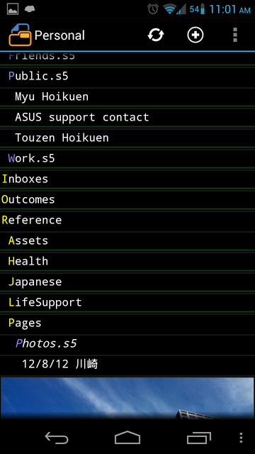
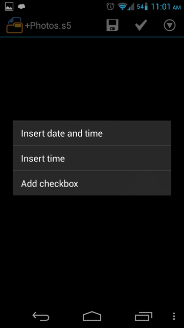
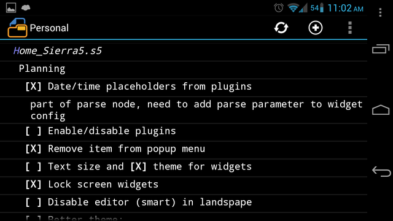
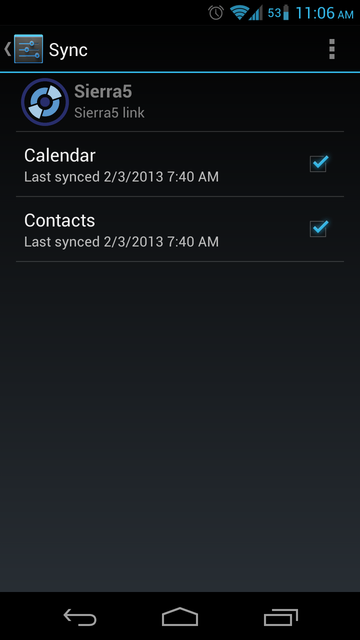

## Sierra5 - Text editor extended with plugins

### General idea
* Two-way inter-process communication
  * Simple application extended with plugins using AIDL [Source](src-aidl/org/kvj/sierra5/common/plugin/Plugin.aidl)
  * Plugins and other application can access data provided by application using AIDL [Source](src-aidl/org/kvj/sierra5/common/root/Root.aidl)
* Structured data, via selectors can be used as a source for other Android OS components (Calendar, Contacts)

### Main application features
* Uses ActionbarSherlock
* Shows folders, files and content with tree-like UI
* Have basic text editor
* Provides double pane interface (tree on left, editor on right) for tablets in landscape
* Supports tab characters, windows/unix line endings
* Renders part of tree to RemoteViews

### Plugins collection
* Provides custom rendering for tree parts, by syntax agreement, using RemoteViews:
  * Render inline images
  * Coloring of text
* Adds custom menu items to context and editor menus
* Has Home screen widgets for displaying parts of tree
* Implements Calendar and Contacts sync providers

### Screenshots

